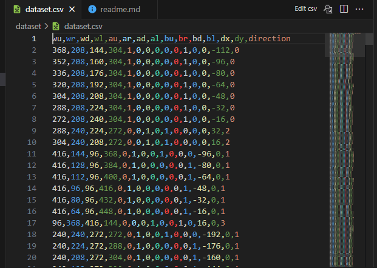

# Snake Machine Learning 

\](assents/image.png)](assents/image.png)

## Discription 

This is a project to train a neural network to play the game snake.
The neural network is trained using a genetic algorithm.
The project is written in python and uses the arcade library for the game.


- generate_dataset.py

Snake moves automatically with rules (if, else, for, while, etc) and write information in a dataset.csv file

###  X :

u: up direction

r: right direction

d: down direction

l: left direction

w: wall

a: apple

b: body

For example

wr is the distance between the snake and the right wall

ad=350 means there is an apple at the bottom of the snake, and the distance between the apple and the head of the snake is 350

bl=0 means there is no part of the snake's body on the left side of the snake's head

---

###  Y :

The direction is the same as label, target or y, which is one of the values u, r, d, l


---
- requirements.txt

List of libraries you need to run

---
- apple.py

Apple class for creating apple objects

---
- snake.py

Snake class to create a snake object

---
- trian.py


Using the created dataset and splitting the data into two parts, train and test, the first is for training the network and learning it, and the second is for testing the result, as well as obtaining loss, accuracy and saving in the snake_game_model file.


](assents/loss_acc.png)


---
- main_manual.py

Snake game with keyboard keys by the user

---
- main_ai.py

Snake game implemented by simple artificial intelligence using multiple if _else conditions

---
- main_ml.py

Snake game implemented by machine learning using neural network


 ## How to install 

```
 pip install -r requirments.txt
 ```
 ## How to run
 1. Generate dataset

 We implemented the game with simple artificial intelligence that we made with a few if _else conditions so that the snake moves towards the apple without the intervention of the user, and after a few moves and eating the apple, all the movements of the snake, which we named as X, were created using pandas. We save the shape of the data frame.

 Null values prevent the execution of the code and reduce the accuracy of the algorithm, we inevitably remove these values with the code in the preprocess section





 2. Train naural network

 We read the dataset with pandas and convert it to numpy array and create a neural network using tensorflow. The input layer is the number of columns of the dataset. The hidden layers are completely optional and also the activation function. Of course, the last layer, because our problem is classification, due to the number of outputs, which is four keys, means the answer to the directions of the snake: up and down, left and right, so it is better for the last layer function to be activated by softmax, it is not a rule based on experience.
 With scikit learn, we divide all the data into two parts, train and test, in order to test it after learning.

 We get loss, accuracy with Tensorflow. I save all the things I said in the train section in the file called snake_game_model.h5.

| loss train     | accuracy  train    | 
| :---           | :---               |
|0.0089          | 0.9971             |


|  loss test     | accuracy test      |
| :---           | :---               |
|  0.0014        | 1.0000             |


 3. Play game

 I will give the file that I saved with the name snake_game_model.h5 to the game that was implemented with simple artificial intelligence to use it and run it. The picture below is the output of the snake game with a neural network.
  


  

